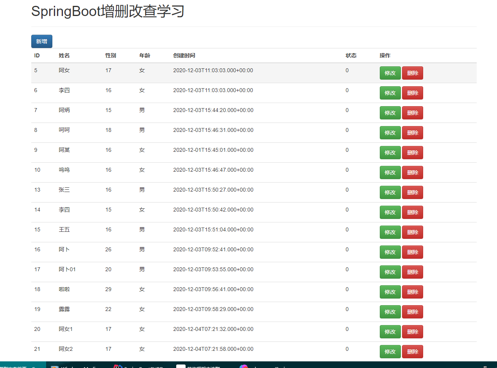
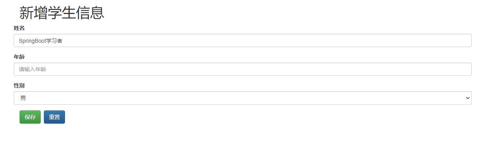
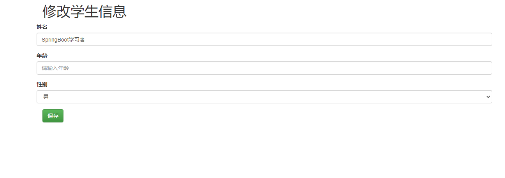
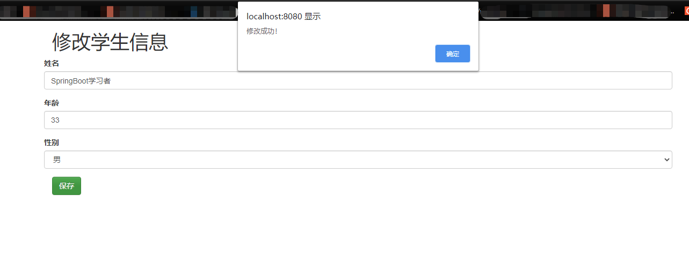

# SpringBoot简单的增删改查

### 学习SpringBoot基本的增删改查

#### 项目采用以下技术点
##### 后端
* SpringBoot
* MyBatis
* MySQL
##### 前段
* Bootstrap
* Jquery前段框架

### 说明

此项目纯粹为了学习而写的，安全性不可保证，请勿使用商业用途！若想下载学习的可以直接下载到本地
### 使用说明

* 克隆本项目到你电脑的某个盘
* 使用IDEA通过MAVEN方式导入项目
* 把MySQL脚本文件单独拿出来，新建一个数据库把数据库脚本运行下数据库就有了
* 修改数据库配置以及服务端口，我用的是8080.若跟您的端口不冲突，可以不改
* 然后运行项目查看效果，想自己优化下都可以
* 如果有更好的想法可以跟我联系，一起学习哈！
## 项目截图
### 列表页

### 添加页

### 修改液

### 删除
点击列表页的删除即可删除
### 感谢SpringBoot框架及bootstrap前段框架
希望有极坏一起学习！

